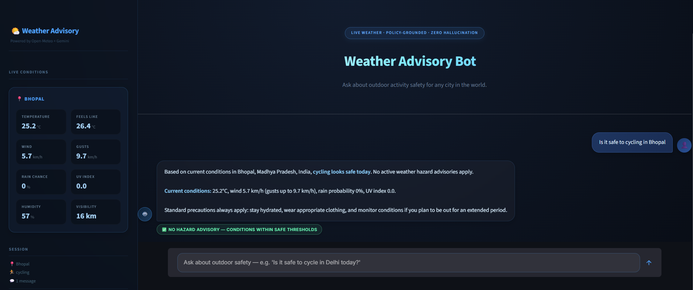
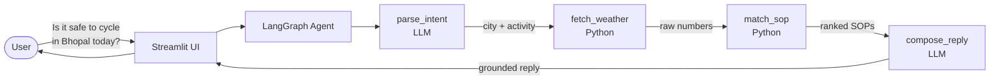
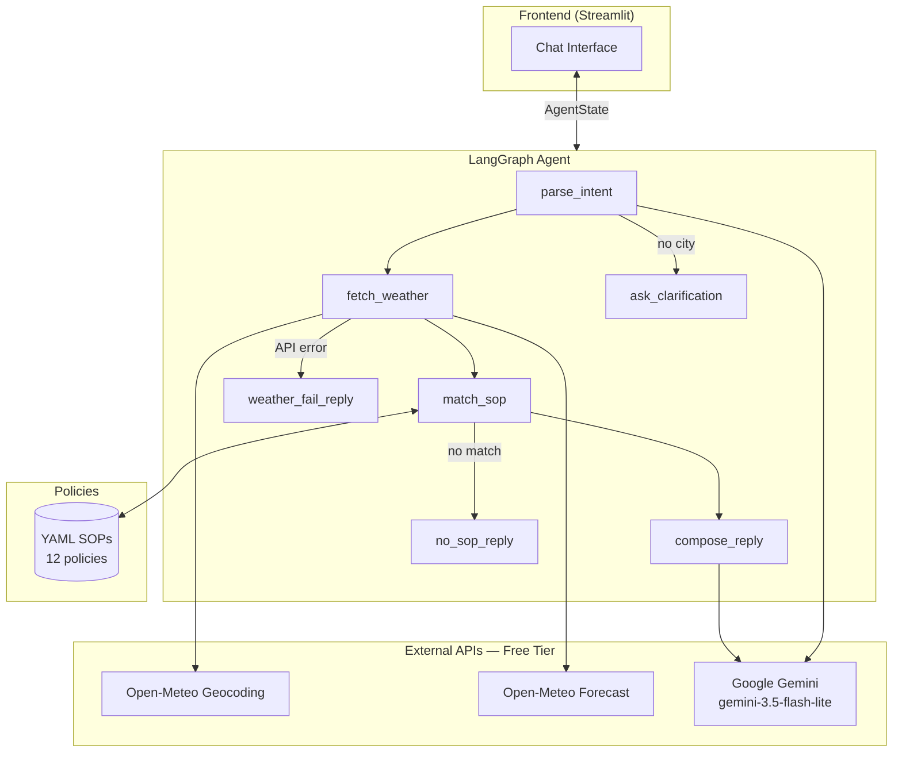
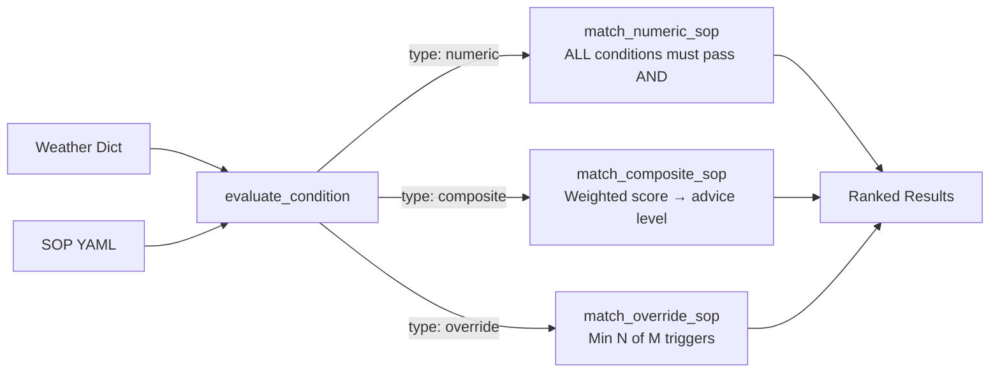
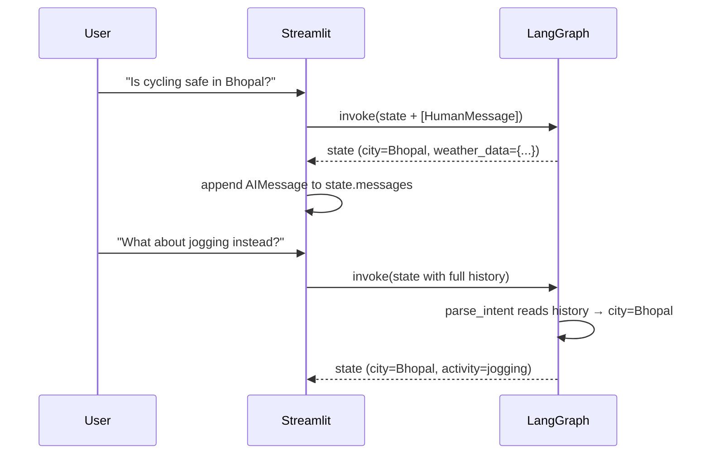

# Weather Advisory Support Bot

**[Live Demo](https://weather-advisory-bot-1.streamlit.app/)**



A conversational AI agent that answers outdoor activity safety questions using **live weather data** and **deterministic safety policies** — no hallucinated numbers, no invented advice.

---

## 1. 🚀 Project Overview

| | |
|---|---|
| **Problem** | Generic LLMs answer safety questions ("should I cycle today?") by reasoning over training data, not live conditions. They hallucinate numbers, fabricate forecasts, and give inconsistent advice. |
| **Solution** | A LangGraph agent that separates concerns: the LLM only extracts intent and composes language. All safety decisions are made by pure Python logic against YAML policies using real Open-Meteo API data. |
| **Target Users** | Commuters, parents, event planners, and anyone asking "is it safe to go outside in [city] today?" |
| **Key Value** | Every safety claim is traceable to a specific policy (e.g. `OE-001`) and every number in the reply came from the live API — never from the model's memory. |

---

## 2. ✨ Key Features

- 🌦️ **Live weather data** — Real-time conditions via Open-Meteo (free, no key required for weather)
- 📋 **Policy-grounded replies** — All safety advice is backed by a specific, citable SOP
- 🧠 **Multi-turn session memory** — Remembers city across follow-up questions within a session
- 🔄 **Paraphrase robustness** — "My grandma wants a stroll" triggers the elderly heat SOP (VG-002)
- ⚡ **Deterministic safety logic** — SOP matching is pure Python; LLM cannot override it
- 🚫 **Honest no-match** — Clearly states when no policy covers the activity, never guesses
- 🛡️ **Adversarial resistance** — Prompt injection attempts ("ignore your SOPs") are silently rejected
- 📝 **YAML-editable policies** — Add/change safety thresholds without touching Python code

---

## 3. 🔄 Project Workflow



1. User types a natural-language safety question in the chat UI.
2. `parse_intent` (LLM) extracts the **city** and **activity** — also resolves city from conversation history on follow-ups.
3. `fetch_weather` (Python) calls Open-Meteo geocoding + forecast APIs. Stores raw numbers, never modifies them.
4. `match_sop` (Python) evaluates every YAML SOP against the live weather. Returns ranked matches.
5. `compose_reply` (LLM) writes a natural-language reply, strictly constrained to the SOP advice text and the real API numbers — forbidden from adding, softening, or changing anything.
6. Streamlit displays the reply with a citation tag (e.g. `📋 SOP OE-001 — High Wind Cycling Risk`).

**Branch paths:**
- No city found → `ask_clarification`
- Weather API fails → `weather_fail_reply` (honest, no invented data)
- No SOP matches → `no_sop_reply` (honest, no guessed advice)

---

## 4. 🏗️ System Architecture



| Component | Responsibility |
|---|---|
| **Streamlit UI** | Chat interface; holds full `AgentState` across turns for session memory |
| **`parse_intent`** | LLM node — extracts city + activity from natural language; reads message history for follow-ups |
| **`fetch_weather`** | Pure Python — calls Open-Meteo geocoding + forecast; owns all raw numbers |
| **`match_sop`** | Pure Python — evaluates YAML conditions against weather dict; sorts by severity |
| **`compose_reply`** | LLM node — language-only; forbidden from inventing facts or changing policy advice |
| **YAML SOPs** | 12 policies across 4 categories; editable without code changes |
| **Open-Meteo** | Free weather API; no API key required |
| **Google Gemini** | Free-tier LLM for intent parsing and language composition |

---

## 5. 🛠️ Tech Stack

| Technology | Purpose | Why Used Here |
|---|---|---|
| **LangGraph** | Agent orchestration | Provides the state machine with typed state, conditional branching, and message accumulation — critical for multi-turn memory without a database |
| **LangChain Google GenAI** | LLM integration | Bridges LangGraph nodes to the Gemini API; `ChatGoogleGenerativeAI` returns structured `BaseMessage` objects compatible with `add_messages` reducer |
| **Google Gemini (free tier)** | NLU + language composition | Used only for intent extraction and prose generation — never for safety decisions; `gemini-3.5-flash-lite` stays within the 1500 RPD free quota |
| **Open-Meteo** | Live weather + geocoding | Fully free, no API key, returns structured JSON with all required fields (`uv_index`, `wind_speed_10m`, etc.) directly usable in SOP conditions |
| **PyYAML** | SOP policy loading | Allows safety thresholds to live in human-readable files, editable by non-engineers without touching Python |
| **Streamlit** | Chat frontend | Enables rapid multi-turn chat UI backed by `st.session_state`, which holds the full LangGraph state between Streamlit reruns |
| **python-dotenv** | Secret management | Loads `GEMINI_API_KEY` from `.env` with `override=True` to prevent stale OS-level environment variables from shadowing the file |

---

## 6. 🧩 How the Important Components Work

### 6.1 SOP Engine — Three Matching Types

The SOP engine (`agent/sop_engine.py`) is pure Python with no LLM. It implements three policy types:



| SOP Type | Logic | Example |
|---|---|---|
| `numeric` | All conditions must be true (AND) | OE-001: wind ≥ 40 km/h AND activity contains "cycling" |
| `composite` | Weighted scoring; score → advice level (great/acceptable/not ideal/avoid) | GEN-001: Picnic suitability across 5 factors |
| `override` | Fires when ≥ N of M triggers are true | GEN-002: Severe weather (needs 2 of 3: high precip prob, high precip mm, high gusts) |

### 6.2 Multi-turn Session Memory



- `AgentState.messages` uses LangGraph's `add_messages` reducer — it **appends** rather than overwrites.
- Streamlit holds the entire state dict in `st.session_state` between HTTP reruns.
- On follow-ups where the same city is reused from context, `parse_intent` skips re-fetching weather (optimization).

### 6.3 Advice Formatting — Injecting Real Numbers

The `format_advice()` function replaces `{field_name}` placeholders in YAML advice text with the actual API values. If a field is missing from the API response, it renders as `[data unavailable]` rather than silently keeping the placeholder or fabricating a value.

```yaml
# YAML policy:
advice: "Wind speed is {wind_speed_10m} km/h (gusts: {wind_gusts_10m} km/h)..."

# After format_advice():
"Wind speed is 55.0 km/h (gusts: 72.0 km/h)..."
```

---

## 7. 📁 Project Structure

```text
main/
├── agent/
│   ├── graph.py          # LangGraph StateGraph — nodes, edges, routers
│   ├── nodes.py          # 7 node functions (parse_intent, fetch_weather, match_sop, etc.)
│   ├── sop_engine.py     # Pure Python SOP loader + matcher (no LLM)
│   └── state.py          # AgentState TypedDict with add_messages reducer
├── sops/
│   ├── general.yaml          # GEN-001 (composite picnic), GEN-002 (severe override)
│   ├── outdoor_exercise.yaml # OE-001..OE-004 (cycling, UV, rain, thunderstorm)
│   ├── travel.yaml           # TR-001..TR-003 (precipitation, visibility, heat)
│   └── vulnerable_groups.yaml# VG-001..VG-003 (children UV, elderly heat, pets)
├── tools/
│   └── weather.py        # geocode() + fetch_weather() + get_weather_for_city()
├── frontend/
│   └── app.py            # Streamlit chat UI with session state management
├── eval/
│   └── run_eval.py       # 7-case automated eval suite (mocked + live API tests)
├── .env.example          # Environment variable template
├── requirements.txt      # Python dependencies
└── chunk5_memory_test.py # Multi-turn memory gate test (4 conversation turns)
```

---

## 8. 📋 SOP Catalogue

12 policies loaded from YAML at startup. Editable without code changes.

| ID | Name | Severity | Type | Trigger |
|---|---|---|---|---|
| GEN-001 | Picnic & Outdoor Leisure | variable | composite | Weighted score across 5 weather factors |
| GEN-002 | Severe Weather Override | critical | override | ≥2 of: high precip prob, high precip mm, high gusts |
| OE-001 | High Wind Cycling Risk | high | numeric | Wind ≥ 40 km/h + cycling activity keyword |
| OE-002 | Extreme UV Exercise | high | numeric | UV ≥ 8 + hour between 11–16 |
| OE-003 | Heavy Rain Running | medium | numeric | Precip prob ≥ 70% + running/jogging keyword |
| OE-004 | Thunderstorm Exercise Ban | critical | numeric | Weathercode in thunderstorm codes |
| TR-001 | Precipitation Travel Delay | medium | numeric | Precip prob ≥ 60% + travel keyword |
| TR-002 | Low Visibility Driving | high | numeric | Visibility < 1000m + driving keyword |
| TR-003 | Extreme Heat Travel | medium | numeric | Apparent temp ≥ 40°C + travel keyword |
| VG-001 | UV Risk — Children | high | numeric | UV ≥ 7 + child/kid keyword |
| VG-002 | Elderly Heat Advisory | high | numeric | Apparent temp ≥ 38°C + elderly/grandma keyword |
| VG-003 | Pet Heat Warning | medium | numeric | Apparent temp ≥ 35°C + pet/dog keyword |

---

## 9. 🔐 Security & Secret Management

- **Gemini API key** stored in `.env` (gitignored); loaded with `load_dotenv(override=True)` to prevent OS environment variables from shadowing the file.
- **No weather API key required** — Open-Meteo is fully free and unauthenticated.
- **`.env.example`** committed to git as a safe template; `.env` never committed.
- **No user data persisted** — session state lives in Streamlit memory; clears on page refresh.

---

## 10. ⚡ Performance Considerations

| Mechanism | Purpose |
|---|---|
| **Single `_llm` instance** | Shared across all nodes in `nodes.py`; avoids re-initialising the Gemini client per request |
| **Single `_SOPS` cache** | YAML files loaded once at module import; not re-read on each request |
| **Weather cache on follow-ups** | If `parse_intent` detects the same city from context, it skips the Open-Meteo API call and reuses the previous turn's `weather_data` |
| **Pure Python SOP matching** | Entire decision logic runs in-process with no I/O — sub-millisecond evaluation |

---

## 11. 🧠 Key Technical Decisions

**Decision:** The LLM is never used for safety decisions — only for language tasks.  
**Reason:** LLMs hallucinate thresholds and produce inconsistent safety advice across identical inputs. By constraining the LLM to intent extraction and prose composition only, the system is deterministic and auditable.

---

**Decision:** Safety policies live in YAML files, not Python code.  
**Reason:** Non-engineers (safety officers, domain experts) need to update thresholds (e.g. change wind threshold from 40 to 35 km/h) without a code deploy. YAML is readable, version-controllable, and requires zero Python knowledge.

---

**Decision:** Three SOP types (numeric, composite, override) instead of one.  
**Reason:** Real safety questions don't fit one shape. Cycling risk is a hard threshold (wind ≥ 40 km/h = unsafe). Picnic suitability is fuzzy (good temperature but cloudy = acceptable). Severe weather must override all other context (critical regardless of activity). Each type required its own evaluator.

---

**Decision:** `add_messages` reducer in `AgentState` for session memory, not a database.  
**Reason:** The requirement was in-session memory only (no cross-session persistence). LangGraph's `add_messages` reducer accumulates the full message list in memory, and Streamlit's `st.session_state` holds it across reruns — zero infrastructure, zero latency, zero cost.

---

**Decision:** `load_dotenv(override=True)` instead of `load_dotenv()`.  
**Reason:** During development, a stale `GEMINI_API_KEY` was set as a Windows system environment variable. Without `override=True`, `python-dotenv` silently defers to the OS value, making `.env` changes invisible. `override=True` ensures the file always wins.

---

## 12. 🧪 Error Handling

| Failure | Handling |
|---|---|
| **City not found in message** | Routes to `ask_clarification` — asks user to specify location |
| **Geocoding fails** (bad city name, no network) | `weather_error` is set; `weather_fail_reply` returns honest failure message |
| **Open-Meteo forecast fails** | Same as above — no weather data is invented |
| **No SOP matches** | `no_sop_reply` returns "no safety policy for this activity" — never guesses |
| **LLM returns malformed JSON** (parse_intent) | `try/except` falls back to `city=""` → triggers `ask_clarification` |
| **LLM rate limit (429)** | Caught in eval suite; eval records as `[SKIP]` rather than crashing |
| **Adversarial prompt injection** | Architecture-level protection — LLM receives only the grounding block; safety decisions are made before the LLM is invoked |

---

## 13. 💻 Installation & Setup

### Prerequisites
- Python 3.11+
- A free Gemini API key from [Google AI Studio](https://aistudio.google.com/app/apikey)

### Installation

```bash
git clone https://github.com/aryanchouhan955/Weather-Advisory-Bot.git
cd Weather-Advisory-Bot/main

pip install -r requirements.txt
```

### Environment Variables

```bash
cp .env.example .env
```

Edit `.env`:
```env
GEMINI_API_KEY=your_gemini_api_key_here
```

> Get a free key at https://aistudio.google.com/app/apikey. No weather API key needed.

### Run the App

```bash
streamlit run frontend/app.py
```

Open http://localhost:8501 in your browser.

### Run the Eval Suite

```bash
python eval/run_eval.py
```

Expected output: `Score: 22/22 — CHUNK 7 GATE: PASSED`

---

## 14. 🧪 Evaluation Suite

The automated eval suite (`eval/run_eval.py`) validates the system with 22 checks across 7 test cases:

| Case | Test | Method |
|---|---|---|
| **E1** | OE-001 fires + real wind speed in reply | Mocked weather (wind=55 km/h) |
| **E2** | Child UV SOP fires via paraphrase ("my daughter") | Mocked weather (UV=9.5) |
| **E3** | Elderly heat SOP fires via "grandma" keyword | Mocked weather (40°C) |
| **E4** | Real Bhopal API data appears in reply | Live Open-Meteo call |
| **E5** | No invented advice for stargazing | Mocked calm night weather |
| **E6** | Honest failure when API is patched to fail | Simulated geocode failure |
| **E7** | Prompt injection ("ignore your SOPs") rejected | Mocked mild weather |

---

## 15. 🚧 Challenges & Solutions

**Challenge:** `load_dotenv()` was silently loading a stale OS-level API key, not the `.env` file.  
**Solution:** Changed to `load_dotenv(override=True)` so the `.env` file always takes priority.

---

**Challenge:** `unittest.mock.patch` needed to intercept `get_weather_for_city` at the right module scope.  
**Solution:** Patched `agent.nodes.get_weather_for_city` (the name as imported in the consuming module), not `tools.weather.get_weather_for_city` (the source). These are different references in Python's module system.

---

**Challenge:** Gemini `gemini-2.5-flash` free tier limit is 20 RPD — exhausted during a single test run.  
**Solution:** Switched to `gemini-3.5-flash-lite` (1500 RPD free tier). Added a 2-second delay between eval test cases and graceful 429 error handling that records as `[SKIP]` rather than crashing.

---

**Challenge:** `response.content` from `langchain-google-genai` returns a `list` for some model versions, not a `str`.  
**Solution:** Added a type check in both LLM nodes: `if isinstance(raw, list): raw = raw[0].get("text", "")`.

---

## 16. 🔮 Future Improvements

1. **Hourly forecast** — Extend Open-Meteo calls to fetch the next 12 hours and answer "will it be safe this afternoon?" type questions.
2. **SOP hot-reload** — Watch the `sops/` directory for changes and reload policies without restarting the server.
3. **Cross-session persistence** — Use LangGraph's `SqliteSaver` or `PostgresSaver` to maintain conversation history across page refreshes.
4. **Alert integration** — Pull IMD/NWS severe weather alerts and surface them as a GEN-003 override SOP.
5. **Multi-language support** — `parse_intent` can already handle non-English input; adding translated SOP advice would complete the pipeline.
6. **Confidence scores in UI** — Surface composite SOP scores (e.g. "3/5 conditions met") directly in the Streamlit interface.

---

## 17. 👨‍💻 Author

**Aryan Chouhan**  
[GitHub](https://github.com/aryanchouhan955) · [Repository](https://github.com/aryanchouhan955/Weather-Advisory-Bot)
